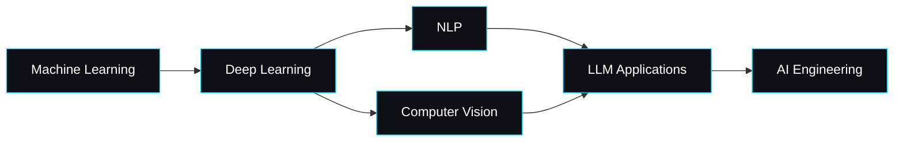

<div align="center">


<br/>


<br/>

<a href="https://github.com/monugupta7033"></a>
<a href="https://www.linkedin.com/in/monu-raj-70bb49376"></a>
<a href="https://huggingface.co/monugupta1805"></a>
<a href="mailto:monugupta7033@gmail.com"></a>

<br/>


</div>

<br/>

## 👨‍💻 About Me

```yaml
status: Learning & Enhancing my skills every day
role: IT Undergraduate exploring AI / ML
focus: [Machine Learning, Deep Learning, NLP, Computer Vision, LLMs]
philosophy: "Learn deeply → Build practically → Improve continuously"
currently_building: Small AI projects to apply what I learn
currently_learning: [Deep Learning architectures, LLM applications, AI Engineering]
contact: monugupta7033@gmail.com
```

<br/>

## 🧠 Tech Stack

<details open>
<summary><b>Languages & Core</b></summary>
<br/>


</details>

<details open>
<summary><b>AI / ML / Deep Learning</b></summary>
<br/>


</details>

<details open>
<summary><b>App / Deployment / Tools</b></summary>
<br/>


</details>

<br/>

## 🚀 Featured Projects

<table width="100%">
<tr>
<td width="50%" valign="top">
<h3>🩸 Fingerprint-Based Blood Group Prediction</h3>
<p>An experimental CV + ML system exploring whether fingerprint ridge patterns correlate with blood-group classification — a non-invasive biometric approach.</p>


```
Image → Preprocessing → Feature Extraction → Classifier → Prediction
```

<a href="https://github.com/monugupta7033/Fingerprint-blood-group-prediction"></a>
</td>

<td width="50%" valign="top">
<h3>🤖 AI Resume Screening & Ranking System</h3>
<p>An NLP-powered recruitment tool that parses resumes, extracts skills, matches them against a job description, and ranks candidates automatically.</p>


```
Resume + JD → Extraction → NLP → Skill Match → Score → Rank
```

<a href="https://github.com/monugupta7033/AI-Resume-Screening-Ranking-System"></a>
</td>
</tr>
</table>

<br/>

## 🗺️ Learning Roadmap



<br/>

## 📊 GitHub Analytics

<div align="center">


<br/>


<br/>

<br/>


</div>

<br/>

## 🐍 Contribution Snake

<div align="center">


</div>

<br/>

## 🎯 How I Work

<div align="center">

`Build before overthinking` · `Master the fundamentals` · `Turn theory into projects` · `Write code, break code, fix code` · `Never stop learning`

</div>

<br/>

## 🌐 Let's Connect

<div align="center">

<a href="https://www.linkedin.com/in/monu-raj-70bb49376"></a>
<a href="https://huggingface.co/monugupta1805"></a>
<a href="mailto:monugupta7033@gmail.com"></a>

</div>


